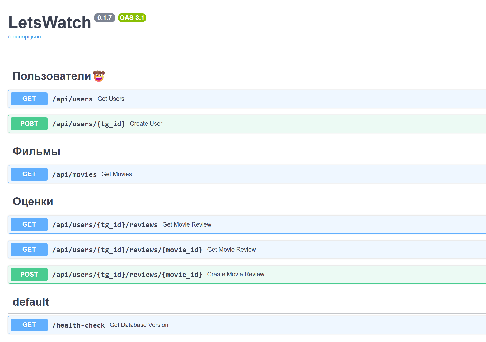
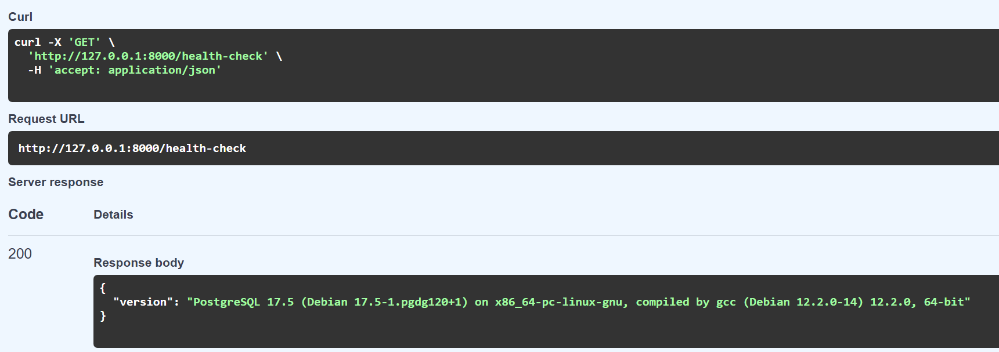
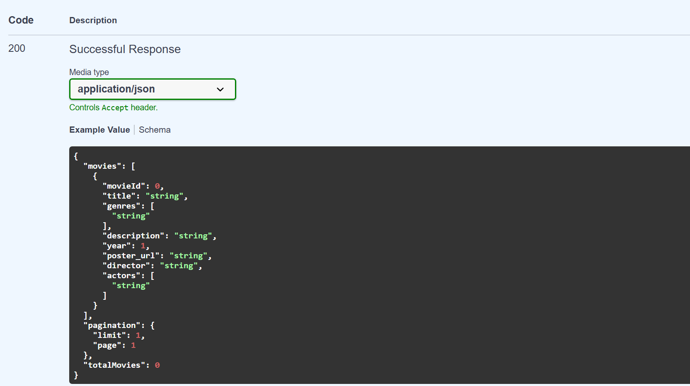

# LetsWatch - Backend

## Как запустить API?

Запускать backend необходимо из этой папки - `backend/`!!!  
Иначе импорты не будут работать правильно

Для запуска backend необходимо: [Docker](https://www.docker.com/products/docker-desktop/)

1. Запустить docker контейнеры с БД

    ```shell
    # Подгрузить образы 
    docker compose pull
    
    # Для запуска контейнеров в фоновом режиме
    docker compose up -d
    
    # Для остановки контейнеров (не забывайте закрывать)
    docker compose down
    ```

2. Установить зависимости

    ```shell
    # Для первого запуска создать venv
    python -m venv venv
    venv/Scripts/activate 
    
    # Установка зависимостей
    pip install -r requirements.txt
    ```

3. Апргейднуться до последней миграции БД

    ```shell
    # Важно! Для запуска комманд alembic необходимо находиться в папке /src
    cd src
   
    alembic upgrade head
    ```

4. Запустить код `python src.main.py`

## Как работать с API?

### Swagger или документация API

Чтобы открыть Swagger (фото ниже) - http://127.0.0.1:8000/docs



С помощью `Try it out` можно тестировать запросы

### Как проверить работает ли БД?

Запустив `GET /health-check` программа должна вернуть такое сообщение



Если такого сообщения не было, возможно вы:
- Не запустили Docker Desktop (обязательно)
- Не успели подтянуть образы
- Не подняли докер контейнеры
- Указали неверный DB_URL (в `.env.example` изначально указан корректный)

Чтобы **проверить данные** находящиеся в БД необходимо перейти 
по - http://127.0.0.1:8000/admin

## Как понять какие данные вернет запрос?

Если раскрыть запрос, внизу будет описана схема ответа API при успешном запросе

